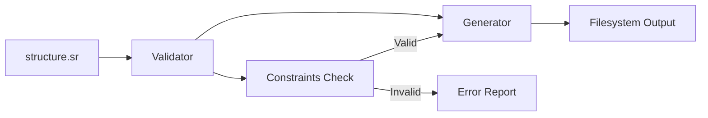

# Scaffoldrite

**Scaffoldrite** is a **project structure validator & generator**.

You define your project structure using a simple `structure.sr` format, then run commands to validate, generate, or modify the structure.

> **Note:** The `structure.sr` file is the source of truth — **not the directory itself**.

---

## 🚀 Who should use it?

### ✅ Framework / Library creators  
Enforce strict project structure for generated projects.

### ✅ Monorepo maintainers  
Enforce consistent folder rules across multiple packages.

### ✅ Teams & Bootcamps  
Enforce a standard architecture and reduce mistakes.

### ✅ Project generators  
Validate output before publishing.

---

## ⭐ Features

- Define folder + file structure using `structure.sr`
- Validate structure against rules (constraints)
- Generate filesystem output
- Create / delete / rename files & folders
- Enforce rules like:
  - required files
  - max files per folder
  - regex filename checks
  - unique filenames
  - folder depth limit
  - and more

---

## 📦 Supported Actions

- Creating starter templates  
- Validating folder/file structure  
- Generating folders and files  
- Modifying the structure file  
- Snapshotting an existing filesystem  

---

## 📌 Source of Truth Flow Diagram



## 🚀 Installation

```bash
npm install -g scaffoldrite
```


## 📁 structure.sr Format

A typical structure.sr file looks like:

```sr
folder src {
  folder components {
    file Button.tsx
  }
  file index.ts
}

constraints {
  eachFolderMustContain ** src index.ts
}
```

## Commands

- scaffoldrite init: Creates a starter structure.sr template.

```bash
scaffoldrite init
```

🔹 Flags

| Flag | Description |
|------|-------------|
| `--empty` | Creates an empty `structure.sr` with only constraints block |
| `--from-fs` | Creates `structure.sr` from current filesystem |
| `--from-fs ./path` | Snapshot a specific folder |
| `--ignore=dist,build` | Ignore specified folders during snapshot |
| `--include=node_modules` | Include `node_modules` (override default ignore list) |
| `--force` | Overwrite existing `structure.sr` |
| `--yes` | Skip confirmation prompts |


```bash
scaffoldrite init --from-fs ./src --ignore=node_modules,dist
```

- scaffoldrite validate: Validates the structure.sr file against the rules and the actual filesystem.

🔹 Usage

```bash
scaffoldrite validate
```

```bash
scaffoldrite validate ./output
```


- scaffoldrite generate: Generates the filesystem structure based on structure.sr.

🔹 Usage

```bash
scaffoldrite generate
```

```bash
scaffoldrite generate ./output
```


- scaffoldrite list: Lists the current structure defined in structure.sr.

🔹 Usage

```bash
scaffoldrite list
```

- scaffoldrite create <path> <file|folder>: Creates a file or folder inside the structure and regenerates filesystem.

🔹 Usage
```bash
scaffoldrite create src/components folder
```

```bash
scaffoldrite create src/index.ts file
```

- scaffoldrite delete <path>: Deletes a file or folder from the structure and regenerates filesystem.

🔹 Usage

```bash
scaffoldrite delete src/components
```

- scaffoldrite rename <path> <newName>: Renames a file or folder inside the structure and regenerates filesystem.

🔹 Usage
```bash
scaffoldrite rename src/index.ts main.ts
```


## Constraints (Commands)

All constraint rules must be inside the constraints {} block.


### Basic Constraints

- require <path>: Ensures the path exists.

```bash
require src
```

- forbid <path>: Ensures the path does not exist.

```bash
forbid src/secret.txt
```

- mustContain <path> <value>: Ensures folder contains a file/folder.

```bash
mustContain src index.ts
```

- mustHaveFile <path> <fileName>: Ensures folder contains a specific file.

```bash
mustHaveFile src index.ts
```

- fileNameRegex <path> <regex>: Ensures all files in folder match regex.

```bash
- fileNameRegex src ^[a-z]+\.ts$
```

- maxFiles <path> <number>: Limits number of files in folder.

```bash
maxFiles src 3
```

- maxFolders <path> <number>: Limits number of folders in folder.

```bash
maxFolders src 2
```

- minFiles <path> <number>: Requires minimum files.

```bash
minFiles src 1
```

- minFolders <path> <number>: Requires minimum folders.

```bash
minFolders src 1
```

- maxDepth <path> <number>: Limits nesting depth.

```bash
-maxDepth src 3
```

- maxFilesRecursive <path> <number>: Limits files recursively.

```bash
maxFilesRecursive src 10
```

- maxFoldersRecursive <path> <number>: Limits folders recursively.

```bash
maxFoldersRecursive src 5
```

- maxFilesByExt <path> <ext> <number>: Limits files by extension.

```bash
maxFilesByExt src .ts 3
```

- maxFilesByExtRecursive <path> <ext> <number>: Limits files by extension recursively.

```bash
maxFilesByExtRecursive src .ts 5
```


### “Each Folder” Constraints

- eachFolderMustContain <scope> <path> <value>: Ensures each folder contains the value.

```bash
eachFolderMustContain ** src index.ts
```

- eachFolderMustContainFile <scope> <path> <fileName>: Ensures each folder contains a file.

```bash
eachFolderMustContainFile * src index.ts
```


- eachFolderMustContainFolder <scope> <path> <folderName>: Ensures each folder contains a folder.

```bash
eachFolderMustContainFolder * src components
```


- eachFolderMustHaveExt <scope> <path> <ext>: Ensures each folder contains a file with extension.

```bash
eachFolderMustHaveExt ** src .ts
```

### Example constraints block

constraints {
  require src
  mustContain src index.ts
  maxFiles src 5
  eachFolderMustContain ** src index.ts
}


## 🧩 Notes

Paths are relative to the root folder

Root is treated as a virtual folder (__root__) and ignored in output.

--yes skips all confirmation prompts.

## 🎉 You're ready!

If you need more rules or want to extend the CLI, just ask.

